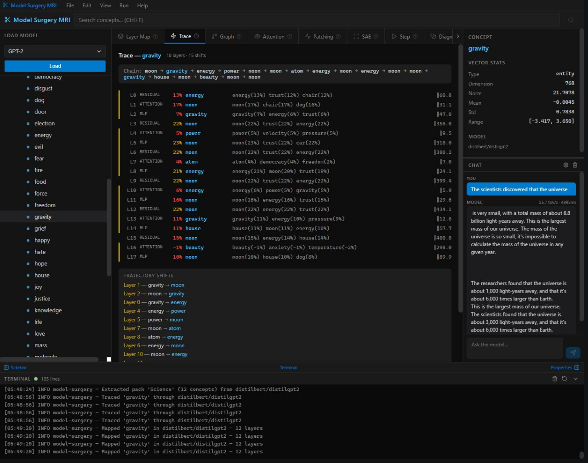
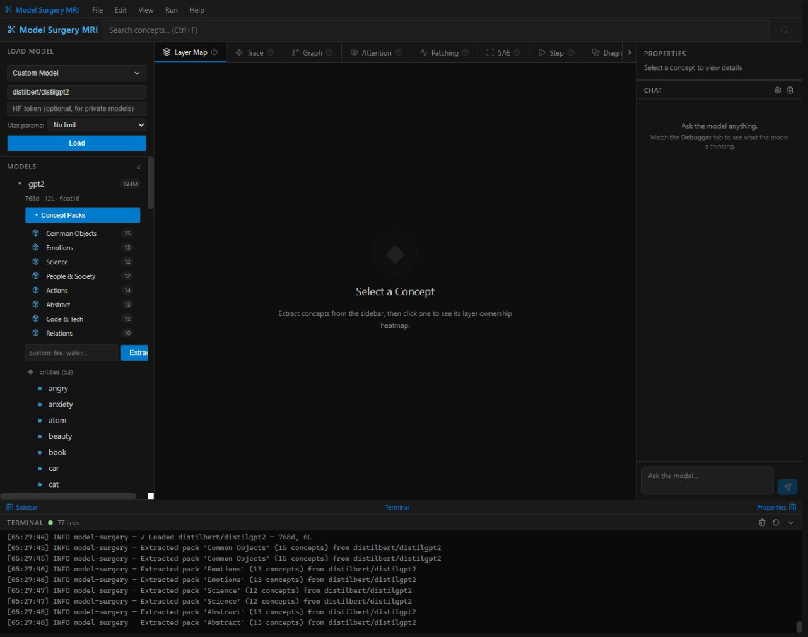
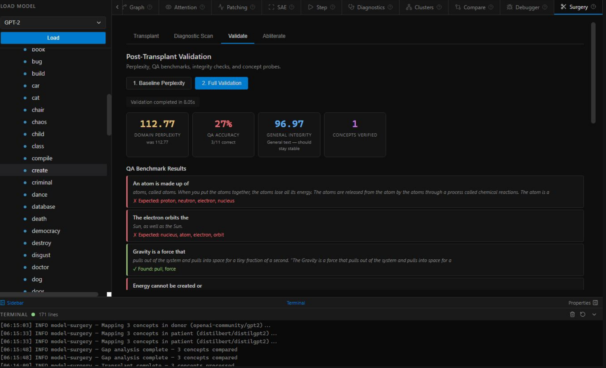
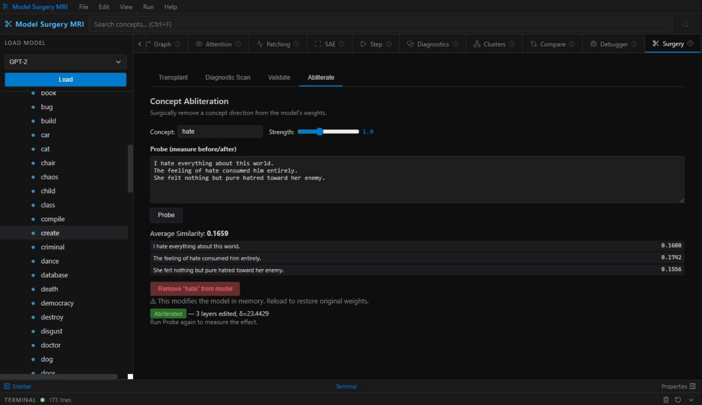
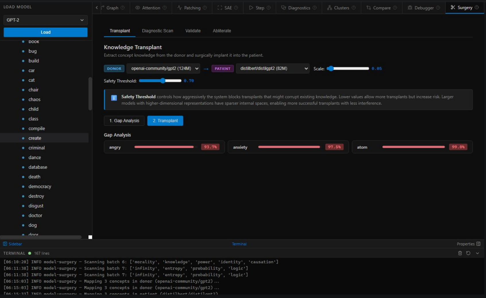
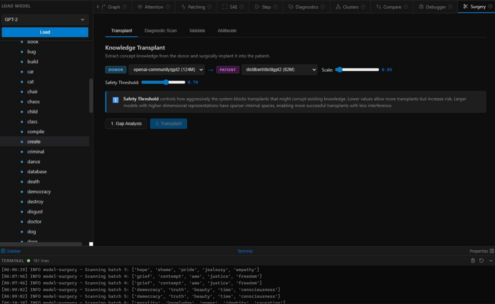
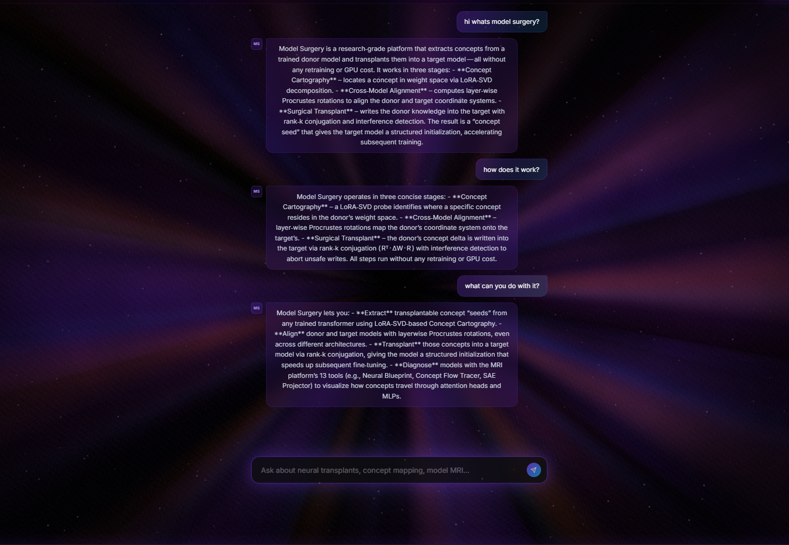
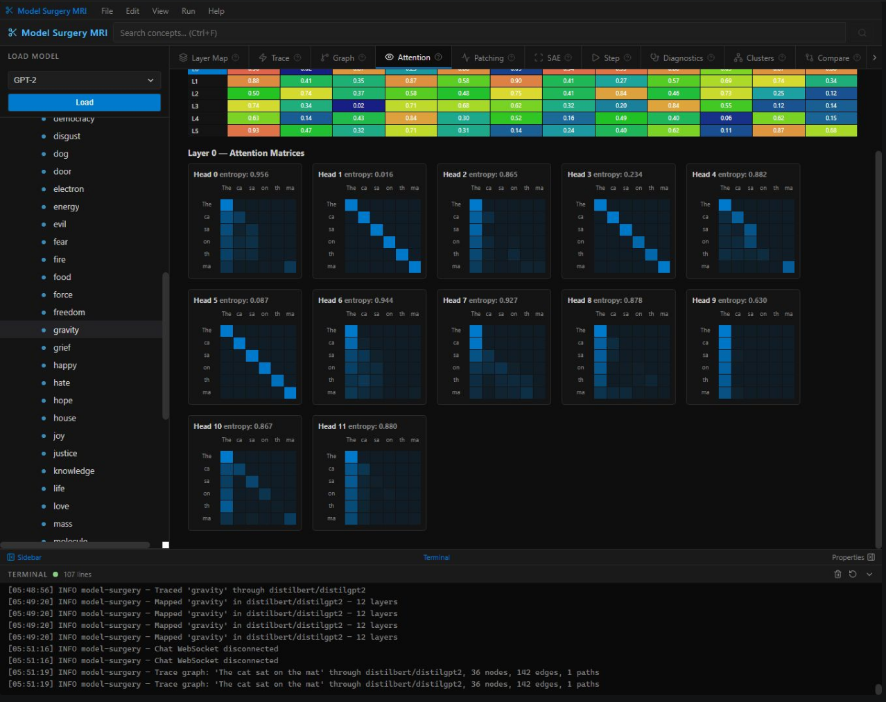

# neural-xray

**X-ray vision into any LLM — no GPU required.**

`pip install neural-xray`

neural-xray is an open-source LLM inspection toolkit that lets you see *inside* transformer models — where concepts live, how they flow through layers, where attention collapses, and what can be surgically modified. Built for researchers, engineers, and anyone who thinks AI should be inspectable.

---

## Why this exists

I'm an independent researcher. I built this tool for my own work on cross-model knowledge transplantation, then got rejected by arXiv for not having an academic endorsement. No university affiliation, no endorser, no platform.

So I'm publishing here, directly. Open-source, no gatekeeping.

If this is useful to you — use it. That's the point.

---

## What it does

| Feature | Description |
|---|---|
| **Concept Tracing** | Inject a concept token, watch it flow through every layer. See trajectory shifts, dominant concepts per layer, attention influence. |
| **Diagnostic Scan** | 7-layer health check: activation magnitude, token entropy, attention head specialization, gradient flow, dead neurons, temporal regularity, contamination. |
| **Concept Extraction** | Hook into MLP layers, pull concept vectors. Works across any architecture — GPT-2, LLaMA, Mistral, Falcon, anything on HuggingFace. |
| **Interactive Visualization** | D3.js HTML output — zoom, click, explore the activation graph. |
| **Semantic Clustering** | Cluster extracted vectors to find which concepts the model groups together. |
| **Knowledge Transplant** | Extract concept knowledge from a donor model and write it into a patient model. Surgical, layer-by-layer. |
| **Concept Abliteration** | Remove a concept direction from model weights in-place. |
| **Sparse Autoencoders** | Optional SAE training on model activations for monosemantic feature extraction. |

---

## Screenshots

### Concept Trace — watching "gravity" flow through every layer


### Layer Map — concept packs and entity extraction


### Diagnostics — 7-layer health scan


### Concept Abliteration — surgical concept removal


### Knowledge Transplant — donor → patient


### Attention Analysis


### Activation Graph


### SAE Features


---

## Quick start

```bash
pip install neural-xray
```

On GPU (Linux/Windows CUDA), enable quantization:
```bash
pip install neural-xray[gpu]
```

### Trace a concept

```bash
neural-xray trace --model gpt2 --concept fire
```

```
[neural-xray] Loading gpt2 ...
  Quantization: float32
  Loaded OK

Trace — fire  (12 trajectory shifts)
  Chain: fire → heat → energy → fire → temperature → fire → heat → combustion

  Layer breakdown:
    L0 RESIDUAL  fire(31%)  heat(18%)  energy(12%)
    L1 ATTENTION fire(28%)  temperature(16%)  combustion(11%)
    ...
```

### Run diagnostics

```bash
neural-xray diagnose --model gpt2
```

```
============================================================
Diagnostic Report — gpt2
============================================================
  ✓ Activation magnitude                score=0.842  (ok)
  ✓ Token entropy                       score=0.791  (ok)
  ⚠ Attention head specialization       score=0.612  (warn)
  ✓ Gradient flow                       score=0.889  (ok)
  ✓ Dead neuron ratio                   score=0.934  (ok)
  ✓ Temporal pattern regularity         score=0.701  (ok)
  ✓ Concept contamination               score=0.855  (ok)

Overall health: 0.803
```

### Extract concept vectors

```bash
neural-xray extract --model gpt2 --concepts fire water gravity love time --output vectors.json
```

### Generate visualization

```bash
neural-xray visualize --model gpt2 --concepts fire water gravity love --output viz.html
# Opens viz.html in browser — interactive D3.js graph
```

### Map architecture

```bash
neural-xray map --model gpt2
```

---

## Python API

```python
from neural_xray import ModelLoader, ConceptFlowTracer, ModelDiagnostics, ConceptExtractor

# Load any HuggingFace model — CPU or GPU, auto-detected
loader = ModelLoader("gpt2", force_quantization="float32")  # CPU
loader.load()

# Trace a concept through all layers
tracer = ConceptFlowTracer(loader)
trace = tracer.trace("fire")
print(trace.top_concepts)       # ['fire', 'heat', 'energy', ...]
print(len(trace.trajectory))    # number of trajectory shifts

# Run diagnostics
diag = ModelDiagnostics(loader)
report = diag.run_all()
for check in report.checks:
    print(f"{check.name}: {check.score:.3f} ({check.severity})")

# Extract concept vectors
extractor = ConceptExtractor(loader)
vectors = extractor.extract(["fire", "water", "gravity"])
# vectors["fire"] is a torch.Tensor of shape [hidden_size]
```

---

## Works with any model

```python
# DistilGPT-2 on CPU
loader = ModelLoader("distilbert/distilgpt2", force_quantization="float32")

# Llama-3 on GPU (8-bit)
loader = ModelLoader("meta-llama/Meta-Llama-3-8B", force_quantization="8bit")

# Mistral on GPU (4-bit, needs: pip install neural-xray[gpu])
loader = ModelLoader("mistralai/Mistral-7B-v0.1", force_quantization="4bit")

# Local path
loader = ModelLoader("/path/to/my/model")
```

---

## Quantization guide

| Hardware | Recommended |
|---|---|
| CPU (any machine) | `float32` |
| GPU <8GB VRAM | `float16` or `8bit` (with `[gpu]`) |
| GPU 8–20GB VRAM | `8bit` |
| GPU >20GB VRAM | `float16` |

`bitsandbytes` is required for `4bit`/`8bit`. Install with `pip install neural-xray[gpu]`. On macOS, use `float32` or `float16`.

---

## Installation

**Minimum (CPU, works everywhere):**
```bash
pip install neural-xray
```

**With GPU quantization:**
```bash
pip install neural-xray[gpu]
```

**Full (SAE + cartography):**
```bash
pip install neural-xray[full]
```

**From source:**
```bash
git clone https://github.com/HeavenFYouMissed/neural-xray
cd neural-xray
pip install -e .
```

Requirements: Python 3.9+, PyTorch 2.2+

---

## Related work

This toolkit was built alongside the Model Surgery paper:

> **Model Surgery: Patent-Pending Neural Knowledge Transplantation**  
> KandD Labs — DOI: [10.5281/zenodo.19467270](https://doi.org/10.5281/zenodo.19467270)  
> GitHub: [HeavenFYouMissed/model-surgery-paper](https://github.com/HeavenFYouMissed/model-surgery-paper)

The paper describes the full theoretical framework for cross-model knowledge transplantation. neural-xray is the practical implementation.

---

## License

MIT — free to use, modify, and distribute.

---

## Contributing

PRs welcome. Issues welcome. If academia won't endorse it, the internet will.

Star the repo if this is useful. It helps independent researchers stay visible.
